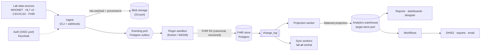

# OpenLDR Community Edition

**A FHIR-native laboratory data integration engine, analytics warehouse, and reporting platform for national lab networks.**

[](#status)
[](LICENSE)
[](#tech-stack)
[](#contributing)

OpenLDR CE ingests heterogeneous laboratory data from any source, normalizes it to **FHIR R4**, persists it to a database the implementing organization controls, and produces domain analytics and surveillance reports — with a strong focus on **antimicrobial resistance (AMR)** surveillance in public-health settings.

---

## Status

**Phases 1–3 are delivered** (spine, country-deployable AMR surveillance, marketplace/extensibility). The stack ships as five published Docker images behind a single HTTPS port and installs in one line. See [Roadmap](#roadmap) for what's next and [`OPENLDR_PRD.md`](OPENLDR_PRD.md) for per-requirement delivery status.

Still pre-1.0, and honest about it:

- Version is `0.1.7`, released under the **Apache License 2.0** (see [License](#license)).
- APIs, migrations, and configuration keys can still change between commits.
- Sustained high-volume warehouse load tuning is ongoing; DHIS2's admin UI is mid-migration into a removable webview plugin.

---

## Why OpenLDR CE

It is built around three commitments learned from real Ministry-of-Health deployments:

- **Data portability is a trust guarantee.** An implementing organization can always extract its complete dataset in open formats, on its own, at any time — `openldr export` writes canonical FHIR (NDJSON + Bundle) plus flat-table CSV and a manifest. No lock-in.
- **Accountability by default.** Every record carries its provenance — what produced it, which plugin and version processed it, and when. Nothing enters the warehouse anonymously.
- **The organization owns its storage.** Final analytics data lands in a database the client chooses (PostgreSQL by default; SQL Server and MySQL/MariaDB behind a swappable adapter), in their own environment. No cloud-database dependency.

---

## What's in the box

| Area | What ships |
|------|------------|
| **Ingest** | File CLI (`openldr ingest`) and an HTTP webhook, both landing in one pipeline (accept → convert → drain) with per-batch provenance, retry, and quarantine. Reference plugins: WHONET SQLite, HL7 v2, tabular (CSV/XLSX), and FHIR transaction Bundles. |
| **FHIR store** | Versioned `fhir` schema → `change_log` → projection worker → flattened read model. The change log is the substrate for both the warehouse projection and distributed sync. Configurable validation strictness (low / medium / **high**). |
| **Forms** | FHIR Questionnaire / SDC engine with a three-pane visual **Form Builder**, coded fields bound to imported code systems, and QuestionnaireResponse capture + extraction. |
| **Terminology** | CodeSystem / ValueSet / ConceptMap services with lookup, validate-code, expand, translate; publishers, systems, terms, value sets, and ontology indexes; LOINC / SNOMED CT / RxNorm / UCUM support; browser **zip upload** of large distributions with background ingest (proven on a 554 MB SNOMED release). |
| **Analytics** | Dashboards with a guided widget **Builder ⇄ SQL** toggle, admin-governed user-defined joins, top-N, AND/OR filter trees, and multi-measure/derived-ratio summarize. |
| **Reporting** | Report library with parameters, run history, scheduling, PDF/document viewer, an AMR/WHO-GLASS-aligned catalog, a drag-drop **Report Designer**, and a `/query` SQL workbench. |
| **Workflows** | n8n-style node builder: **60 node types across 6 categories** (Core, Communication, Developer Tools, Databases, Files & Storage, Data Transformation), cron/webhook/ingest triggers, run history, an encrypted secret store, and a QuickJS-WASM sandboxed Code node. |
| **Distributed sync** | Lab ⇄ central replication over the FHIR change log: live enable/disable without restart, site enrollment, cursor reporting, drain + push wakeup, divergence detection, amendments, patient merge, quarantine, gzip transport, and signed offline bundles for air-gapped sites. |
| **Extensibility** | Signed, capability-scoped marketplace bundles with an audited install/update/rollback lifecycle; Extism/WASM plugins (Rust SDK) for format adapters and sinks; webview plugins that contribute their own pages at `/x/:pluginId` via a versioned UI SDK; DB-stored **Connectors** with AES-256-GCM secrets (DHIS2 ships this way). |
| **Governance** | Capability-based RBAC (**37 capabilities**, 5 seeded system roles: `lab_admin`, `lab_manager`, `data_analyst`, `system_auditor`, `lab_technician`) enforced per route; append-only audit log; runtime per-column **Data Exposure** policy; notification bell with history and preferences; activity + sync observability feeds. |
| **Operations** | First-class CLI with `--json` on every command, coded error catalog, health probes across all adapters, one-line installer, Let's Encrypt automation, and in-app + public versioned documentation in English, French, and Portuguese. |

---

## Architecture

OpenLDR CE is a **modular monolith** with a hexagonal (ports-and-adapters) core: every external dependency sits behind an interface and can be swapped without touching domain logic. Writes and reads are separated — canonical FHIR is the write model, and a projection worker derives the flattened read model from the change log.



**Two databases, by design:**

- **Internal DB** (always PostgreSQL) — operational state and the canonical FHIR write model: users, roles, audit log, queue/outbox, pipeline state, change log, configuration.
- **Analytics warehouse** (client-chosen; PostgreSQL by default, SQL Server or MySQL/MariaDB via adapter) — the system of record for domain data (requests, results, isolates, patients, facilities). It receives **flattened, relational** projections of the FHIR data, so it stays portable across database engines.

**The four ports** (each with a default adapter, all swappable per deployment):

| Port | Default adapter | Alternatives |
|------|-----------------|--------------|
| Auth (OIDC) | Keycloak | any OIDC provider |
| Blob storage (S3 API) | MinIO | any S3-compatible store |
| Eventing / orchestration | Postgres outbox + `pg_notify` | — |
| Target data store | PostgreSQL | SQL Server, MySQL / MariaDB |

**Plugins** are sandboxed, **any-language** format adapters and sinks (built on Extism/WASM, with a Rust SDK in [`wasm/`](wasm)). A plugin reads an arbitrary input format — for example a WHONET SQLite export — validates it, and converts it to FHIR R4, without rebuilding the application. Sandbox boundaries are documented in [`docs/security/plugin-sandbox.md`](docs/security/plugin-sandbox.md).

---

## Tech Stack

| Layer | Choice |
|-------|--------|
| Language | TypeScript (end-to-end) |
| Monorepo | Turborepo + pnpm workspaces |
| Package manager | pnpm 11.13.0 (pinned via `packageManager`) |
| Runtime | Node.js 20+ |
| Backend | Fastify |
| Query layer | Kysely (Postgres · MySQL/MariaDB · SQL Server · SQLite) |
| Databases | PostgreSQL 16 (internal + default warehouse); SQL Server 2017/2019/2022 and MySQL 8.4 / MariaDB 11.4 as warehouse targets |
| Data model | FHIR R4 (hand-rolled over the official schema) |
| Plugin runtime | Extism / WASM (Rust plugin SDK) |
| Workflow code sandbox | QuickJS compiled to WASM |
| Frontend | React + Vite + Tailwind + shadcn/ui |
| Canvas / charts | `@xyflow/react` (workflow canvas) · Recharts (dashboards) |
| PDF | PDFKit |
| i18n | react-i18next (English · French · Portuguese) |
| Auth | Keycloak 26 (OIDC), OpenLDR-branded login theme |
| Blob storage | MinIO (S3-compatible) |
| Testing | Vitest (unit) · Playwright (E2E, UI capture, docs screenshots) |
| Reverse proxy / TLS | nginx (single HTTPS port; Let's Encrypt via certbot) |

---

## Getting Started

Three paths, in increasing order of effort.

### 1. Install the published stack (no clone, no build)

Pulls the five GHCR images and brings up the full single-port stack. Full options — bring-your-own certificate, scaffold-only, upgrades, teardown — are in [DEPLOYMENT.md](DEPLOYMENT.md).

```bash
curl -fsSL https://raw.githubusercontent.com/Open-Laboratory-Data-Repository/openldr/main/install/install.sh | bash -s -- --server-name your.domain.com --letsencrypt you@email.com
```

Windows hosts use [`install/install.ps1`](install/install.ps1) with the same flags.

### 2. Developer bootstrap (clone + install + backing services + DB, one command)

```bash
curl -fsSL https://raw.githubusercontent.com/Open-Laboratory-Data-Repository/openldr/main/install/development.sh | bash
```

Accepts `--dir`, `--branch`, `--seed` (loads the WHONET sample dataset), `--reset-db`, and `--no-services`. Windows: [`install/development.ps1`](install/development.ps1).

### 3. Manual setup

**Prerequisites:** Node.js 20+ (LTS), pnpm (enable with `corepack enable`), Docker & Docker Compose.

```bash
git clone https://github.com/Open-Laboratory-Data-Repository/openldr.git
cd openldr

pnpm install
cp .env.example .env

# Backing services only: Postgres (:5433), MinIO (:9010), Keycloak (:8180).
# SQL Server and DHIS2 sit behind opt-in compose profiles and do NOT start here.
docker compose up -d

pnpm openldr db migrate
pnpm openldr health          # confirm every adapter is reachable

pnpm -C apps/server dev      # terminal 1 — API on :3000, serves the Studio SPA under /studio
pnpm -C apps/studio dev      # terminal 2 — Studio dev server (HMR)
pnpm -C apps/web dev         # terminal 3 (optional) — public landing site + docs
```

Optional sample data — builds the WASM plugins, resets the DB, and ingests a WHONET export. Requires the Rust/WASM toolchain (see [`wasm/rust-toolchain.toml`](wasm/rust-toolchain.toml)):

```bash
pnpm e2e:seed
```

Opt-in backing services:

```bash
docker compose --profile mssql up -d
docker compose --profile dhis2 up -d
```

### Verification commands

```bash
pnpm typecheck && pnpm test && pnpm build
```

`pnpm lint` runs ESLint in `apps/server` (the only package with real lint rules). `pnpm build:check` builds each binary **and smoke-runs the `dist/` artifact** — see [Contributing](#contributing) for why that matters. `pnpm e2e` runs the Playwright suite.

---

## The CLI

OpenLDR CE ships a first-class CLI so the entire system is drivable and inspectable from the command line — useful for operators and for automated troubleshooting. Every command supports `--json`.

```bash
pnpm openldr health                                    # probe every adapter (auth, storage, eventing, store)
pnpm openldr db migrate                                # internal + target schema
pnpm openldr ingest samples/whonet-sample.sqlite --plugin whonet-sqlite
pnpm openldr pipeline status                           # inspect ingest batches
pnpm openldr pipeline retry <batchId>
pnpm openldr plugin list                               # installed WASM plugins
pnpm openldr terminology lookup <system> <code>
pnpm openldr report list
pnpm openldr sync status                               # workers, cursors, pending backlog
pnpm openldr audit list
pnpm openldr errors list                               # the coded error catalog
pnpm openldr export                                    # full dataset: FHIR NDJSON + Bundle + CSV + manifest
```

The full source-backed surface — every command and subcommand, with captured help output — is in [`docs/CLI-REFERENCE.md`](docs/CLI-REFERENCE.md).

> **Note:** DHIS2 has no core CLI. It ships as a removable plugin and is driven from its own screens or from workflow nodes.

---

## Project Structure

```
openldr/
├── apps/
│   ├── server/         # Fastify API; also hosts the built Studio SPA under /studio in dev
│   ├── studio/         # React + Vite SPA — the signed-in application
│   └── web/            # React + Vite landing site + public versioned documentation
├── packages/           # 29 workspace packages
│   ├── adapter-auth/           # Keycloak / OIDC adapter
│   ├── adapter-db-store/       # PostgreSQL target-store adapter
│   ├── adapter-event-bus/      # Postgres outbox + pg_notify eventing
│   ├── adapter-mssql-store/    # SQL Server target-store adapter
│   ├── adapter-mysql-store/    # MySQL / MariaDB target-store adapter
│   ├── adapter-s3-bucket/      # S3 / MinIO blob adapter
│   ├── audit/                  # append-only audit store
│   ├── bootstrap/              # application context wiring + first-run seeds
│   ├── cli/                    # OpenLDR CLI
│   ├── config/                 # environment schema
│   ├── core/                   # AppError + coded error catalog, shared primitives
│   ├── dashboards/             # dashboard query model, compile, SQL runner
│   ├── db/                     # internal/target schemas, migrations, stores
│   ├── dhis2/                  # DHIS2 aggregate/tracker domain logic (surfaced via the plugin)
│   ├── fhir/                   # FHIR R4 resources, validation, versioned store
│   ├── forms/                  # FHIR Questionnaire / SDC form engine
│   ├── ingest/                 # ingest pipeline (accept, convert, drain)
│   ├── marketplace/            # signed artifact bundle lifecycle
│   ├── plugin-ui-sdk/          # versioned host↔webview-plugin SDK
│   ├── plugins/                # Extism/WASM runtime + sandbox
│   ├── ports/                  # port interfaces for adapters
│   ├── rbac/                   # capabilities, role presets, requireCapability
│   ├── report-designer/        # drag-drop report page designs
│   ├── report-pdf/             # PDF rendering
│   ├── reporting/              # AMR / WHO-GLASS report catalog
│   ├── sync/                   # distributed lab⇄central sync workers
│   ├── terminology/            # terminology, distributions, ontology services
│   ├── users/                  # local user profiles
│   └── workflows/              # workflow engine, node handlers, triggers, stores
├── wasm/               # Rust plugin sources + the plugin SDK crate
├── reference-plugins/  # built reference plugins (whonet-sqlite, hl7v2, tabular, dhis2-sink, …)
├── deploy/             # nginx single-port gateway, Keycloak theme, TLS scripts
├── install/            # one-line install + developer bootstrap (sh + ps1)
├── infra/              # Keycloak realm assets
├── e2e/                # Playwright smoke, UI capture, and docs screenshots
├── samples/            # WHONET / HL7 / CSV / XLSX sample datasets
├── scripts/            # build, seed, and live-acceptance scripts
└── docs/               # CLI, configuration, HTTP API, operator guide, audits, design trail
```

---

## Deployment

OpenLDR CE is designed to run behind a **single HTTPS port**. Production environments often allocate only one or two ports, so an nginx reverse proxy terminates TLS (via Let's Encrypt/Certbot) and path-routes the SPA, API, docs site, and auth callbacks under one origin. Only the gateway publishes host ports; Postgres, MinIO, Keycloak, api, studio, and web are reachable on the compose network only. All application code is proxy-relative — no hard-coded hosts or ports.

Five independently-versioned images are published to GHCR:

| Image | Contents |
|-------|----------|
| `ghcr.io/open-laboratory-data-repository/openldr-api` | Fastify API + `/health` |
| `ghcr.io/open-laboratory-data-repository/openldr-studio` | Studio SPA (static nginx, served under `/studio/`) |
| `ghcr.io/open-laboratory-data-repository/openldr-web` | public landing site + docs |
| `ghcr.io/open-laboratory-data-repository/openldr-gateway` | nginx reverse proxy |
| `ghcr.io/open-laboratory-data-repository/openldr-keycloak` | Keycloak 26 with the OpenLDR login theme baked in |

Install by pulling those images (`install/install.sh` | `.ps1`), or build from source with the `pnpm run init` wizard over `docker-compose.prod.yml`. See **[DEPLOYMENT.md](DEPLOYMENT.md)** for the images, both TLS paths, the external-database support matrices, the environment reference, and the smoke check; **[RELEASE.md](RELEASE.md)** covers publishing.

---

## Documentation

| Document | Contents |
|----------|----------|
| [`docs/OPERATOR-GUIDE.md`](docs/OPERATOR-GUIDE.md) | Day-to-day operation: setup, dashboards, reports, workflows, marketplace, forms, ingesting data, users/audit, distributed sync, i18n |
| [`docs/CLI-REFERENCE.md`](docs/CLI-REFERENCE.md) | Every CLI command and subcommand, with captured help output |
| [`docs/CONFIGURATION.md`](docs/CONFIGURATION.md) | Environment variables, feature flags, and settings keys |
| [`docs/HTTP-API.md`](docs/HTTP-API.md) | REST surface |
| [`DEPLOYMENT.md`](DEPLOYMENT.md) · [`RELEASE.md`](RELEASE.md) | Production deployment and image publishing |
| [`OPENLDR_PRD.md`](OPENLDR_PRD.md) | Consolidated PRD — architecture, phase requirements, delivery status, deferred work |
| [`DESIGN.md`](DESIGN.md) | Design system and visual language |
| [`docs/security/`](docs/security) · [`docs/audit/`](docs/audit) | Plugin sandbox model, security audits, code reviews |

The same operator documentation is also served in-app under `/studio/docs` and publicly from the landing site, version-aware and translated into English, French, and Portuguese.

---

## Roadmap

Per-requirement status lives in [`OPENLDR_PRD.md`](OPENLDR_PRD.md).

- [x] **Phase 1 — The Spine**
  Hexagonal core + the four ports, FHIR R4 data layer, forms-from-templates engine, ingest pipeline with provenance, Extism/WASM plugin runtime + WHONET SQLite reference plugin, multi-driver reporting, audit log, decoupled users, CLI, Playwright harness.
- [x] **Phase 2 — Country-Deployable AMR Surveillance**
  SQL Server warehouse adapter, terminology service (LOINC + AMR reference), DHIS2 integration (aggregate + tracker, mapping-driven), WHO-GLASS-aligned report pack, HL7 v2 & tabular plugins, in-app documentation.
- [x] **Phase 3 — Ecosystem & Extensibility**
  Marketplace for plugins, forms, and reports — local-first, with signed artifacts, capability-based permissions, and an audited install lifecycle.
- [x] **Beyond the phase PRDs**
  Workflow Builder, webview plugins + UI SDK, DHIS2 as a WASM sink plugin + dynamic Connectors, Reports page, Form Builder, Report Designer, dashboard widget builder, capability-based RBAC, distributed lab⇄central sync, terminology distribution upload, notification bell, MySQL/MariaDB target, production single-port Docker stack, en/fr/pt sweep.

**In flight**

- Distributed-sync live testing (LAN phase 1) ahead of further sync feature work.
- Migrating DHIS2's admin UI into a removable webview plugin, deleting the in-host page.
- Sustained high-volume warehouse load tuning.

**Deferred, with the seams left clean**

Oracle target-store adapter · Kafka/Inngest eventing adapters · desktop (Electron/Tauri) wrapper · FHIR R5 · formal WHO-GLASS submission-file export · governed central marketplace catalog.

**Candidate — Phase 4: Intelligence**

AI/agentic services over the FHIR/warehouse data: assisted mapping, data-quality detection, MCP-exposed tools, local/edge inference.

---

## Contributing

Contributions are welcome. A few conventions:

- Use **pnpm** (workspaces). Commit the lockfile; do not use npm or yarn.
- Keep commits small and scoped; reference the relevant requirement IDs from [`OPENLDR_PRD.md`](OPENLDR_PRD.md) where practical.
- Commits should not include AI co-authorship trailers — authorship belongs to the human contributor.
- Add Playwright coverage for new UI surfaces and tests for new core logic.
- New admin/settings features need **CLI parity** — the system must stay fully drivable from the command line.
- Never inline clinical vocabularies into source or SQL; codes belong in the terminology service.
- **Run built artifacts, not just build them.** Dev and tests execute TypeScript from source (`tsx`/`vitest`), so a bundling regression in the `tsup` ESM output can pass everything and still crash the shipped binary at startup. Acceptance for `@openldr/cli` and `apps/server` must launch the `dist/` artifact — run `pnpm build:check` (or `pnpm --filter <pkg> build:check`), which builds each binary and smoke-runs it.

Before opening a PR: `pnpm typecheck && pnpm test && pnpm build`, plus `pnpm build:check` if you touched `@openldr/cli` or `apps/server`.

The formal contributing guide is still pending; until it lands, follow the conventions above and the verification commands in this README.

---

## License

OpenLDR CE is released under the **Apache License 2.0**. The full text is in [`LICENSE`](LICENSE).

The Rust plugin SDK ([`wasm/openldr-plugin-sdk`](wasm/openldr-plugin-sdk)) carries the same Apache-2.0 license, so third parties can author and distribute plugins under their own terms across the sandboxed plugin boundary.
