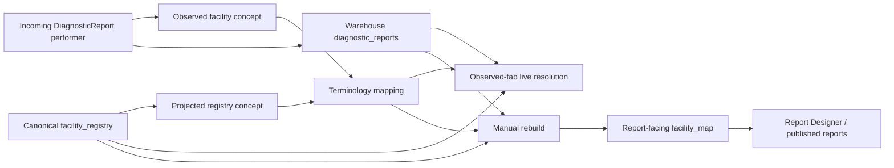

# Facilities Page Audit - Registry, Resolution, and Ministry Readiness

Review date: 2026-08-07

Scope: the Studio **Facilities** page and its Registry and Observed tabs; facility create/edit/delete; national registry CSV import; observed-facility scanning; Terminology mapping hand-off; facility-registry concept projection; the report-facing `facility_map`; distributed reference-data sync; permissions, auditability, accessibility, responsive behavior, and operational safety.

Audience: Claude Code and future implementers.

No source-code fix was made by this audit. This is a prioritized implementation and design punch list. It is a new audit and does not replace the report-design audit.

## Executive verdict

The Facilities page is one of the stronger-looking administration pages in the application. The Registry/Observed split is the right mental model, the dark theme is restrained, table density is good, and ranking observed facilities by report count is an excellent operational choice. The page already does meaningful work and is not a failed design.

It is not yet safe to treat as the authoritative facility-resolution workflow for Ministry reporting. The main risks are below the visual layer:

- the Observed tab can show a mapping as successful while published reports continue using the old or raw facility until a separate hidden rebuild is run;
- `facility_registry` is captured as synchronisable reference data, but the sync serve/apply paths do not implement that entity, creating a risk of bogus deletes and failed downstream applies;
- CSV rows with excess fields can be accepted with values shifted into the wrong columns, silently corrupting master-list data;
- a facility's mapping identity is based on editable human codes, allowing a code change or deletion to leave stale, still-searchable concepts and broken mappings;
- multiple active mappings are permitted and resolution chooses one without a deterministic or enforced facility-specific rule;
- the generic Terminology dialog offers relationship types that the resolver ignores, so even `UNMAPPED-FROM` or `RELATED-TO` can behave as a facility resolution;
- the registry list and browser import are capped at 2,000 rows even though the intended national master list is much larger;
- destructive changes do not use the impact analysis the server already calculates.

The visible `Browse` problem is real, but it is not a broken click handler. It is a permanently unavailable control in this workflow: Browse is only enabled for an ontology distribution with a ready index, while the facility registry is a flat, local coding system and the Facilities page supplies no such distribution. It should be removed from this task-specific flow, not repaired cosmetically.

The oddness of manual scanning also has an architectural cause. New observed performers are captured during ingestion, while Scan is a backfill and report-count refresh operation that also performs unrelated registry projection. The UI exposes it as a manual correctness step without explaining when it is needed, what has become stale, or when it last ran. Routine correctness should be automatic; a manual rescan should remain only as a clearly labelled maintenance/repair action.

The recommended direction is to keep the visual language but redesign the workflow around one invariant:

> A user action must not look complete until the canonical registry, the mapping used by resolution, and the report-facing facility dimension are in a consistent and observable state.

## Review basis and limits

The audit is based on:

- live read-only inspection of the current local Facilities page, including Registry, Observed, import, edit, and mapping sheets;
- read-only inspection of the Facilities UI, API routes, registry store, import/parser, terminology mapping, reconciliation/publish, report dimension, sync, dashboard data-exposure, migrations, specifications, and tests;
- focused execution of the current Facilities test suites.

The live review instance contained one registry row and 88 observed facilities, with one observed facility visibly resolved. Those counts are environment-specific evidence, not product requirements.

Focused test result at the time of review:

- Studio: 75/75 passed, with extensive React `act(...)` warnings in import/dialog tests;
- Terminology CSV: 13/13 passed;
- Bootstrap reconciliation/import: 104/104 passed;
- Server Facilities routes: 103/103 passed, but many route tests log swallowed facility-concept projection failures because the test context lacks a usable terminology database.

Passing tests do not negate the findings below. Several unsafe behaviors are explicitly pinned by tests, including accepting ragged CSV rows, retaining concepts for deleted facilities, swallowing projection failures, allowing a facility write to succeed when projection fails, and deleting every active mapping candidate.

This audit does not certify a particular national master-facility-list schema, Ministry governance policy, data-sharing agreement, or facility-status vocabulary. Those must be confirmed with the registry authority. The technical design should support a configured authority rather than hard-code assumptions about one country or register.

## Current data flow and where the confusion comes from



The Observed page resolves from live terminology mappings and registry rows. Reports do not; they use the separately rebuilt `facility_map`. This split is the reason the interface can say “mapped” while reports remain stale.

## What should be preserved

- **Registry versus Observed is the correct top-level split.** It separates canonical facilities from raw names/codes arriving in reports.
- **Report-count ordering is excellent triage.** The facilities affecting the most reports appear first.
- **Observed display and location context are useful.** Name, district, and region help distinguish similar codes.
- **The visual styling is disciplined.** The page has a coherent dark theme, compact rows, clear headers, and restrained colour.
- **Permission boundaries are present.** `facilities.view` and `facilities.manage` are enforced in both UI and routes.
- **Import previews before apply.** Unknown columns are surfaced and require an explicit opt-in; BOM and common header variations have tests.
- **Writes are audited.** Create, update, delete, import, scan, and publish have audit paths.
- **Core facility fields and form extras are separated carefully.** Existing extras are preserved across edits, cleared fields are handled deliberately, and administrative suggestions can be scoped by parent selections.
- **Mappings are pointed at a registry coding system.** The implementation has begun to distinguish target-missing and non-facility targets.
- **Reports have a raw-performer fallback.** A missing canonical mapping does not turn the facility into a blank value.
- **Database portability has received attention.** PostgreSQL, SQL Server, and MySQL behavior is considered in the reconciliation path.

These are substantive strengths. The audit does not recommend replacing the page or decorating it heavily; it recommends making its clean surface trustworthy.

## Priority definitions

- **P0 - blocks authoritative or distributed use:** can silently corrupt, misresolve, delete, or leave official report data inconsistent.
- **P1 - required for a dependable Ministry workflow:** creates serious scale, governance, recoverability, accessibility, or operator-error risk.
- **P2 - professional refinement:** improves clarity, efficiency, and visual quality after data integrity is secured.

## P0 findings - resolve before authoritative use

### FAC-P0-01 - Mapping success and report output can disagree

Saving a mapping refreshes the Observed list, which resolves directly from `term_mappings`. It does not rebuild the report-facing `facility_map`. A separate page-menu action calls the full publish/rebuild. The same staleness applies after facility rename, code change, and delete.

This produces a dangerous split-brain state:

1. an operator maps `BALAB` to a canonical facility;
2. the Observed row immediately looks resolved;
3. Report Designer and published report SQL can continue using the previous/raw facility value;
4. no visible indicator says the report dimension is dirty or when it was generated.

Required direction:

- Update or enqueue the affected `facility_map` rows after mapping and facility mutations.
- Use a transactional outbox/retryable job if registry and warehouse cannot be updated atomically.
- Display `Report facility data: current / updating / failed / stale`, last successful generation time, and affected-row count.
- Keep a full rebuild only as a repair/maintenance operation, not a routine step required for correctness.
- Make report generation use a defined snapshot/generation and record that generation for auditability.
- Add end-to-end tests proving that mapping, remapping, rename, code change, retirement, and delete produce the expected report-facing value without a hidden manual step.

Relevant implementation: `apps/studio/src/facilities/ObservedTab.tsx:152-165`, `:291-296`, and `:455-459`; `packages/bootstrap/src/facility-reconcile.ts:624-690`.

### FAC-P0-02 - `facility_registry` sync is declared but not implemented end to end

`facility_registry` is included in the reference change-log entity types, and registry writes capture changes. However:

- the central sync-serving switch has no `facility_registry` case;
- an upsert whose body resolver returns `null` is emitted as a delete;
- the receiving reference-apply switch also has no `facility_registry` case and rejects the unknown entity.

This means distributed use can turn a central registry upsert into a bogus deletion instruction, then fail/quarantine when applied at a lab. This is more severe than “sync is unfinished” because change capture is already active and implies support.

Required direction - choose one safe state immediately:

- fully implement serve and apply behavior, including create/update/delete, `managed_origin`, conflict behavior, tombstones, and idempotency; **or**
- remove/disable `facility_registry` change capture and entity registration until that support exists.

Add a genuine central-to-lab integration suite covering create, rename, administrative update, retirement/delete, replay, duplicate delivery, and preservation of locally managed facilities. Do not ship the half-registered state.

Relevant implementation: `packages/db/src/reference-change-log.ts:8-33`, `packages/bootstrap/src/sync-serve.ts:43-72` and `:154-281`, `packages/db/src/reference-apply.ts:313-340`, and registry writes in `packages/bootstrap/src/facility-registry-store.ts:262-281`.

### FAC-P0-03 - Ragged CSV rows can silently shift values into the wrong facility fields

The CSV parser uses `relax_column_count: true`. A row with an unescaped comma and one excess value can be accepted rather than rejected. A direct reproduction during the audit showed:

```csv
national_code,name,level,region
1,Clinic, East,Hospital,Dodoma
```

being interpreted approximately as:

- name: `Clinic`
- level: `East`
- region: `Hospital`
- trailing `Dodoma`: dropped

That is silent master-data corruption: the row parses, no unknown column is reported, and the wrong values can be applied. The existing “ragged row does not throw” test treats this permissiveness as expected behavior.

Required direction:

- Require the exact field count for each record, or quarantine each malformed row with its line number and raw content.
- Never silently drop excess fields.
- Block Apply while structural row errors exist.
- Provide a downloadable error file with source line, error, and safe preview.
- Add explicit tests for too few fields, too many fields, unescaped commas, multiline quoted names, duplicate headers, duplicate national codes, malformed quotes, and mixed line endings.

Relevant implementation: `packages/terminology/src/facility-csv.ts:67-119` and `packages/bootstrap/src/facility-import.test.ts`.

### FAC-P0-04 - A facility mapping target is based on mutable human codes rather than stable identity

Registry rows are projected into the facility coding system using `local_code`, then `national_code`, then the UUID only as a fallback/collision escape. A mapping points to that projected code. If an operator changes the local code, the canonical facility's mapping target changes.

The projection cleanup only removes a superseded UUID-keyed concept. It does not reliably remove a prior local-code or national-code concept. The old concept can remain searchable as a ghost, and an existing mapping can become `targetMissing`. Deleted facilities are also intentionally retained as terminology concepts and remain available to pick.

Required direction:

- Use the immutable `facility_registry.id` as the canonical mapping code.
- Store local and national identifiers as searchable aliases/properties with their systems, not as the target's primary identity.
- If compatibility requires code-based targets, add an explicit alias/migration layer and transactionally migrate existing mappings when an identifier changes.
- Tombstone/deactivate projected concepts when a facility retires or is deleted. Keep them resolvable for audit/history, but exclude them from new selection.
- Run a migration that detects stale concepts, broken targets, and mappings to deleted facilities; produce a review report before changing them.

Relevant implementation: `packages/bootstrap/src/facility-reconcile.ts:511-523`, `:701-708`, `:772-832`, and `:945-950`.

### FAC-P0-05 - Multiple active mappings are allowed and resolution is ambiguous

The database does not enforce one active facility mapping per observed coding `(system, code)`. The resolver selects the first active registry-target candidate without a deterministic facility-specific ordering. The UI opens `outgoing[0]`, which is ordered by creation time, and “Remove mapping” deletes every active outgoing candidate.

Consequences include:

- the Observed row can display or edit a different mapping from the one the resolver happened to use;
- database order can affect which facility appears in reports;
- an unrelated active terminology mapping can coexist with the facility mapping;
- the remove action can erase more mapping records than the operator thinks they selected.

Required direction:

- Enforce one active facility-resolution mapping per `(from_system, from_code)` for the facility namespace.
- Save/remap as a transaction that deactivates or supersedes the previous mapping with audit history.
- Detect existing conflicts and show `Ambiguous - review required`; never silently choose one.
- Define deterministic resolution only as a defensive fallback, not as a substitute for the invariant.
- Show mapping ID, target, creator, creation/update time, and history in the resolution detail.

Relevant implementation: `packages/db/src/migrations/013_term_mappings.ts:5-31`, `packages/bootstrap/src/facility-reconcile.ts:493-560`, `apps/studio/src/facilities/ObservedTab.tsx:201-214` and `:248-266`, and ordering in `packages/bootstrap/src/terminology-admin-store.ts:567-569`.

### FAC-P0-06 - Mapping relationship semantics are offered but ignored by facility resolution

The reused generic Terminology dialog lets the operator choose SAME-AS, NARROWER-THAN, BROADER-THAN, RELATED-TO, and UNMAPPED-FROM, plus relationship, owner, and active state. The facility resolver does not filter on `map_type`; it treats any active mapping to the registry system as a resolution.

An operator can therefore record `UNMAPPED-FROM` or `RELATED-TO` and still cause reports to resolve to that facility. This contradicts what the UI says and makes mapping governance unreliable.

Required direction:

- Use a facility-specific “Resolve observed facility” sheet.
- Lock the saved semantic to the one facility resolution relationship actually supported, normally exact/SAME-AS.
- If broader/narrower relationships are genuinely required, specify their report behavior and make the resolver enforce it; do not inherit generic options by accident.
- Reject unsupported map types at the API/domain boundary, not only in the UI.
- Migrate or flag existing active facility mappings with unsupported semantics.

Relevant implementation: `apps/studio/src/terminology/TermMappingDialog.tsx:41-99` and `packages/bootstrap/src/facility-reconcile.ts:493-500`.

### FAC-P0-07 - `facility_map` silently collapses distinct observed coding namespaces

Resolution can preserve two logical observed facilities with the same source feed/code but different wire-supplied `performer_system`. The report-dimension ID, however, is derived only from source system/feed plus source code. Publish then deduplicates a primary-key collision and keeps one row.

The implementation documents this collision but handles it by silently dropping one candidate. If two coding namespaces legitimately reuse the same code, one facility resolution cannot be represented in `facility_map`, and reports can join to the wrong facility.

Required direction:

- Include the observed coding system/namespace in the dimension's natural key and report join.
- Carry that system through `diagnostic_reports` and report-designer datasets consistently.
- Alternatively, prove and enforce a domain invariant that the upstream feed/code pair uniquely identifies a facility and reject conflicting `performer_system` values at ingestion.
- Never resolve a collision by first-row-wins deduplication.
- Add cross-feed and same-code/different-system end-to-end report tests.

Relevant implementation: `packages/bootstrap/src/facility-reconcile.ts:660-678` and the feed-aware resolution tests in `packages/bootstrap/src/facility-reconcile.test.ts`.

### FAC-P0-08 - Facility projection failures are deliberately hidden from the operator

Create, update, and import write the registry row and then best-effort project it into the facility terminology system. Projection exceptions are caught and logged; the user-facing operation still succeeds. The route tests repeatedly log this failure while passing, and one test explicitly requires that a failed projection not prevent creation.

The result is a facility that exists in Registry but cannot be found in the mapping picker. There is no failed-projection badge, retry queue, health panel, or recovery guidance. A hidden rescan/rebuild may later repair it, but the operator cannot know that it is needed.

Required direction:

- Record projection work in a durable outbox/job with pending, succeeded, failed, retry count, and last error.
- Show registry/search-index consistency on the page and on the affected facility.
- Retry automatically and provide an authorised repair action.
- Do not report the overall operation as fully complete while a required projection is failed; use a truthful partial-success state if the registry write must remain committed.
- Add integration tests with the real terminology store contract instead of allowing undefined test dependencies to generate swallowed errors across otherwise passing route tests.

Relevant implementation: `packages/bootstrap/src/facility-reconcile.ts:883-955` and `apps/server/src/facilities-routes.ts:626` and `:700`.

## P1 findings - required for a dependable national workflow

### FAC-P1-01 - The Registry tab cannot operate at national master-list scale

The client asks for at most 2,000 facilities and renders them all. There is no server-side page/offset/cursor, total count, search box, or filtering UI. The server can return a larger bounded limit but still exposes no paging metadata. A national list of roughly 10,000-15,000 rows makes most facilities unreachable in the page.

The truncation banner is inferred from `data.length >= 2000`; exactly 2,000 real rows can therefore produce a false warning, and the page cannot say how many records are omitted.

Required direction:

- Add server-side cursor or offset pagination and an authoritative total.
- Search normalized name, local code, national code, aliases, and administrative area.
- Filter by country, zone, region, district, council, level, operational status, registry source, managed origin, and mapping/projection health where relevant.
- Put query/filter/page state in the URL.
- Use virtualization only as a rendering optimization, not as a replacement for server paging.
- Test with the expected maximum register size and realistic long names.

Relevant implementation: `apps/studio/src/api.ts:771-785`, `apps/studio/src/pages/Facilities.tsx:63-65` and `:192-195`, `apps/server/src/facilities-routes.ts:348-375`, and `packages/bootstrap/src/facility-registry-store.ts:246-254`.

### FAC-P1-02 - The browser import cannot apply the master list it is intended to manage

The page allows a large file to be previewed but refuses Apply over 2,000 parsed rows and directs the operator to a CLI. That can be a reasonable short-term safety cap, but it means the primary national-registry use case is unavailable to a normal Ministry administrator.

Required direction:

- Convert imports to background jobs with upload storage, chunked processing, progress, validation stage, cancel, retry/resume, and final reconciliation summary.
- Keep the CLI for automation and very large controlled operations, but do not make shell access the only path for the intended workload.
- Ensure apply is transactional per defined batch and recoverable across process restarts.
- Surface who imported which source release and when.

Relevant implementation: `apps/studio/src/facilities/ImportFacilitiesSheet.tsx:26-37` and `:162-169`, and `apps/server/src/facilities-routes.ts:39-55` and `:761-766`.

### FAC-P1-03 - Import “preview” does not show the database impact

Dry run reports parsed/skipped/duplicate/unknown-column counts but returns zero created and updated because it exits before comparing with the registry. Apply counts existing rows as updated even if their material data is unchanged. The operator cannot see the facilities that will be added, changed, left unchanged, conflicted, or retired.

Required direction:

- Compare parsed rows with the current registry during preview.
- Report create, changed, unchanged, duplicate, invalid, conflict, and absent-from-release counts accurately.
- Show sample diffs with old/new values and downloadable complete results.
- Require a second confirmation when high-impact fields or unusually large percentages change.
- Record file hash, source release/version, row count, schema mapping, actor, and result.
- Define rollback/revert as a new audited operation rather than deleting audit history.

Relevant implementation: `packages/bootstrap/src/facility-import.ts:220-247` and `apps/studio/src/facilities/ImportFacilitiesSheet.tsx`.

### FAC-P1-04 - Registry source identity is an unsafe free-text field

The import sheet asks for `National system` as arbitrary text and suggests values such as HFR or MFL. That byte-for-byte value participates in deterministic IDs and uniqueness. Variants such as `HFR`, `hfr`, and a canonical URI can create separate identities for the same register.

Required direction:

- Model registry sources explicitly: authority, canonical system URI, display name, country/jurisdiction, release/version, contact, and active status.
- Select an existing source in the import sheet; make creating a source a separate privileged action with validation.
- Normalize and migrate historical variants only after showing collisions.
- Display the source beside national identifiers throughout the page.

Relevant implementation: `apps/studio/src/facilities/ImportFacilitiesSheet.tsx:44` and `:236-245`, and `packages/terminology/src/facility-csv.ts:35-36` and `:96-98`.

### FAC-P1-05 - Import validation is too permissive for national reference data

In addition to ragged rows:

- non-numeric coordinates become `null` without a row error;
- finite but impossible latitude/longitude ranges are accepted;
- status, level, and country values are not tied robustly to canonical codes;
- rows absent from a later register are never retired or reported as stale;
- an import racing an operator edit can overwrite the edit;
- duplicate national codes use last-row-wins behavior.

Required direction:

- Validate latitude `[-90, 90]` and longitude `[-180, 180]` as a pair.
- Normalize only under documented rules and preserve the raw source value.
- Validate controlled fields using source-to-canonical mappings, not display strings.
- Report absent rows and require an explicit retirement policy; never infer deletion silently.
- Add optimistic version checks or an import lock/conflict queue for concurrent edits.
- Quarantine duplicate identities for review unless the source contract explicitly defines a deterministic winner.

Relevant implementation: `packages/terminology/src/facility-csv.ts:44-49`, `packages/bootstrap/src/facility-import.ts:187-205`, and import tests.

### FAC-P1-06 - Delete ignores the impact analysis that already exists

The server has `GET /api/facilities/:id/impact` and can calculate affected mapping and report counts. The Registry page never calls it. Delete shows generic confirmation and then hard-deletes the row.

Deletion can leave mappings targeting a missing facility, stale report-dimension rows, and a retained ghost concept that remains selectable. For registry data, deletion is usually the wrong default lifecycle action.

Required direction:

- Prefer `Retire`, `Close`, `Deactivate`, or `Merge` over hard delete.
- Before a destructive operation, display facility identity, source, mapping count, affected report count, and downstream consequences.
- Block hard delete while active mappings exist unless a privileged, explicit remediation is selected.
- Provide remap/merge as part of the flow.
- If hard delete remains, remove it from the ordinary row menu and require a typed confirmation plus an audit reason.

Relevant implementation: `apps/server/src/facilities-routes.ts:507-569` and `:706-712`, `apps/studio/src/pages/Facilities.tsx:297-304`, and current delete strings around `apps/studio/src/i18n/en.ts:767-768`.

### FAC-P1-07 - There is no duplicate-detection or facility-merge workflow

A manually created facility and a later master-list import can represent the same real facility with different IDs. Name spelling, code changes, administrative reorganisation, and multiple registers can also create duplicates. The page provides no candidate detection, comparison, or safe merge.

Required direction:

- Create a duplicate-review queue based on exact national identity first, then human-reviewed code/name/location signals.
- Never fuzzy-auto-merge authoritative facilities.
- Make merge preserve one stable ID, identifiers, aliases, mappings, provenance, and change history.
- Show every downstream mapping/report impact before confirmation.
- Support “link local facility to registry record” as a safer guided task than deleting/recreating.

### FAC-P1-08 - Source, ownership, and managed status are hidden

Registry records include origin/source concepts, but the table and edit sheet do not explain whether a row is manual, imported, centrally synced, or locally managed. A centrally managed row can be edited or deleted without warning even though a later sync can overwrite it.

Required direction:

- Show source badges such as Manual, Imported, Synced, and Local override.
- Show registry authority, source system, release/version, last sync/import, and managed origin in facility details.
- Make centrally managed fields read-only, or provide an explicit local-override workflow with precedence rules and conflict visibility.
- Add a facility change-history timeline with actor/source and before/after values.

### FAC-P1-09 - Facility status and level are stored/displayed as unstable labels

The current model can flatten values to display strings such as `Active`, while an external register may use `Operating`, `Closed`, or its own codes. Exact-string filtering and grouping will fragment semantically equivalent states. Operational status, inclusion in a registry, and service capability are also different concepts.

Required direction:

- Persist canonical system + code and render the current display separately.
- Define mappings from each registry source's vocabulary to the canonical vocabulary.
- Distinguish operational status from record lifecycle/active-in-register status.
- Version vocabulary changes and audit remapping.
- Do the same for facility level; do not assume Tanzania-specific levels are universally portable.

### FAC-P1-10 - Form selection is implicit and configuration failures are misdiagnosed

Facility create/edit asks for published forms and uses the first acceptable summary. If more than one facility-targeted form is published, selection is implicit. If loading published forms fails, the page can present the state as “no form published,” hiding an API/auth/network error.

Required direction:

- Assign exactly one current Facility capture form/version per tenant or page configuration.
- Validate that it targets Facilities and contains the required core identity fields.
- Keep immutable registry identity fields enforced at the domain layer even if the configurable form omits them.
- Distinguish loading failure, unauthorised, invalid configuration, and genuinely unconfigured states.
- Cancel or generation-guard asynchronous form loading so a quickly closed/switched dialog cannot receive stale schema/answers.

Relevant implementation: `apps/studio/src/facilities/FacilityDialog.tsx:99-131` and `apps/studio/src/pages/Facilities.tsx:86-91`.

### FAC-P1-11 - “Scan for new facilities” mixes routine ingestion, repair, and projection

New performers are captured during ingestion, but their report count starts at zero. Scan is then needed to backfill and refresh counts. The scan action also publishes registry concepts, an unrelated side effect. It runs immediately from a hidden menu with no preview, job progress, last-run information, or explanation.

Required direction:

- Refresh observed counts incrementally or on a scheduled job.
- Run a guided first-install backfill and expose its state.
- Rename the manual repair action to `Rescan warehouse` and place it under Maintenance.
- Before running, show what it reads/writes and offer dry-run counts for high-volume stores.
- Display last successful scan, current watermark, duration, rows processed, and errors.
- Separate registry projection repair from observed-facility scanning.

Relevant implementation: `apps/studio/src/facilities/ObservedTab.tsx:130-150` and `packages/bootstrap/src/facility-reconcile.ts:147-254` and `:961-964`.

### FAC-P1-12 - The mapping flow should be a facility picker, not a generic terminology editor

The current sheet asks users to understand Map type, Relationship, Owner, target system, active mapping, manual coding, and ontology browsing. This is unnecessary terminology jargon for the task “make this incoming facility resolve to that registry facility.”

The picker also lacks the information needed to choose safely: national/local code distinction, registry source, status, level, and full administrative path.

Required direction:

- Title the sheet `Resolve observed facility`.
- Show the observed code, supplied name, feed/coding system, location, first/last seen, and report count in a fixed source panel.
- Search the registry directly using its paged API.
- Show candidate name, local code, master-list code and system, level, status, full location, and source.
- Add `Create facility`, `View facility`, and `Open in Terminology` secondary links where authorised.
- Confirm the affected report count and state that report data will update automatically.
- Keep the generic Terminology editor for specialist terminology administration, not the primary Facilities workflow.

Relevant implementation: `apps/studio/src/terminology/TermMappingDialog.tsx` and `apps/studio/src/facilities/ObservedTab.tsx:446-450`.

### FAC-P1-13 - The Browse control is structurally impossible in this workflow

Browse is enabled only when a target coding-system distribution has a ready ontology index. The facility registry has no ontology distribution and the Facilities flow does not pass one. The disabled control is therefore permanent, matching the reported “Browse never works” experience.

Required direction:

- Remove Browse from the facility-specific sheet.
- Make the default and prominent action `Find facility`.
- If hierarchical exploration is wanted later, implement a real facility browser by administrative hierarchy or map—not an ontology-index button.
- Do not show controls that can never become available in the current context.

Relevant implementation: `apps/studio/src/terminology/TermMappingDialog.tsx:186-193` and `:540-579`.

### FAC-P1-14 - Terminology search can include inactive targets and has weak async/a11y behavior

The facility flow requests statuses `ACTIVE` and `DRAFT`, but `TermPicker` only sends a status to the API when exactly one is selected. With two, no status filter is sent, potentially returning inactive/retired/ghost terms. Search has no robust loading/error state, stale requests can race, and the results do not implement full combobox/listbox keyboard semantics.

Required direction:

- Query registry rows directly and filter according to a documented facility lifecycle policy.
- Exclude deleted/retired records from new mapping while allowing historical resolution.
- Implement loading, error with Retry, no-results, and minimum-query states distinctly.
- Cancel or ignore stale requests when query/system changes.
- Implement labelled combobox/listbox roles, `aria-expanded`, active descendant, keyboard navigation, selection announcement, and focus return.

Relevant implementation: `apps/studio/src/terminology/TermPicker.tsx:21-25`.

### FAC-P1-15 - System-managed observed metadata can be lost in Terminology

Observed facility concepts store operational properties such as first seen, last seen, and report count. Generic Terminology editing does not preserve all of those managed properties. The reconciliation tests explicitly document first-seen reset after a term edit.

Required direction:

- Mark observed-facility and registry-projection terms as system-managed.
- Prevent generic edits to identity and operational metadata, or merge namespaced managed properties safely.
- Let an operator curate an alias/display in a dedicated field without replacing ingest metadata.
- Show a link between the Terminology record and the Facilities workflow.

Relevant implementation: comments around `packages/bootstrap/src/facility-reconcile.ts:130-136` and the corresponding reconciliation tests.

### FAC-P1-16 - Source/feed identity is hidden despite being part of correctness

The same observed code can legitimately arrive under different source feeds or wire coding systems. Resolution tests support this distinction, but the page usually presents the code/name/location without making the system/feed prominent. A default `webhook-ingest` source can also fold senders that were not configured distinctly.

Required direction:

- Display observed coding system and source feed at least in detail, and inline when a code is ambiguous.
- Warn on source-system configuration collisions and generic/default feed use.
- Provide filters by feed/system and health metrics for unconfigured performer systems.
- Ensure every ingest integration has a stable, unique source identifier and documented performer-system precedence.

### FAC-P1-17 - Report data governance does not explicitly cover `facility_map`

The report dimension contains curated facility names, codes, and administrative areas and is used as a report join. It is included in data export, but it is not present in the dashboard governed/joinable exposure lists inspected during this audit.

Required direction:

- Make an explicit governance decision: whether `facility_map` is selectable, joinable, exportable, and visible by role.
- Register it in the same data-exposure policy used by report/dashboard tooling rather than relying on accidental availability.
- Keep internal stable IDs separate from public/export identifiers where required.
- Add tests that Report Designer can use the intended fields and cannot expose disallowed registry metadata.

Relevant implementation: `apps/server/src/dashboards-routes.ts:20-29` and `packages/dashboards/src/models/registry.ts:16-30` and `:178-190`.

### FAC-P1-18 - Concurrent edits use last-write-wins without visible conflict handling

Facility edit has no version/ETag. Two operators, a sync, or an import can overwrite one another. The import code explicitly acknowledges the race between read/merge/write.

Required direction:

- Add a version or `updated_at` precondition to update/delete.
- On conflict, show the submitted and current values and let the operator reload or reconcile.
- Apply source precedence rules for synced/imported fields rather than silent last writer.
- Include version/source in audit records and background jobs.

### FAC-P1-19 - Error states can leave stale data looking current

A background reload error can leave existing rows visible with only a banner. Scan/publish result text persists without a timestamp or clear dismissal. Projection failures do not appear at all. There is no consolidated health state for registry, observed scan, mappings, projection, or report dimension.

Required direction:

- Mark retained results as `Showing data from <time>; refresh failed`.
- Add visible Retry actions and distinguish empty, error, unauthorised, unconfigured, and loading states.
- Time-stamp and make maintenance results dismissible.
- Add a compact Facilities health/status panel for administrators.

### FAC-P1-20 - Primary workflow actions are hidden in kebab menus

Add, Import, Scan, Rebuild, Preview, Apply, and Save are placed in overflow menus or sheet kebabs. Overflow is appropriate for infrequent/destructive/maintenance actions, but it makes primary progress actions hard to discover and contributes to the feeling that Scan is strange.

Required direction:

- Put the current primary action visibly in the header or sticky sheet footer.
- Registry: visible `Add facility` and `Import` where permitted.
- Observed: visible search/filter and `Resolve` per unresolved row; keep rescan/rebuild under Maintenance.
- Import: visible `Preview` then `Apply import` with stateful disabled reasons.
- Edit: visible `Save changes`; keep Delete in a separate danger area.

## P2 findings - visual, interaction, and professional refinement

### FAC-P2-01 - Add a page purpose statement and operational summary

The page currently opens directly into tabs and a table. A short subtitle should explain:

> Maintain the canonical facility registry and resolve facility identifiers received in laboratory reports.

Add compact metrics that lead to action rather than decorative cards:

- Registry total;
- observed codes mapped / total;
- percentage of report rows resolved;
- needs attention: ambiguous, target missing, inactive target, projection failed;
- report facility data freshness.

Metrics should be clickable filters and must not require loading the entire registry into the browser.

### FAC-P2-02 - Improve Registry information architecture

The current columns are Code, Name, Region, District, and Status. `Code` silently chooses local code over national code and hides the coding system/source. Important identity is therefore collapsed.

Recommended default columns:

- Facility name;
- Local code;
- Master-list code (with source/system tooltip or detail);
- Level;
- District / Region;
- Operational status;
- Source/managed badge;
- resolution/projection warning;
- actions.

Use a detail drawer or column chooser for country, zone, council, coordinates, timestamps, extras, and full provenance. Do not force every field into the table.

### FAC-P2-03 - Improve Observed triage and progress visibility

The reviewed instance had 88 observed rows and one mapped row, but the page offered no progress summary or filter. Add:

- All, Unresolved, Resolved, and Needs attention filters with counts;
- search across code, supplied name, feed/system, and location;
- `Resolved reports / total reports` as the more meaningful progress measure;
- clear state badges with text, not low-contrast prose;
- an inline Resolve action for unresolved rows;
- server-side pagination and filtering for scale.

If the supplied display equals the code, do not repeat it on a second line. Truncate long location paths visually while keeping full accessible text/detail.

### FAC-P2-04 - Make the edit sheet read as a data record, not a validation error

Required labels currently use a red exclamation mark even when fields are valid. Red `!` conventionally signals an error. Use a normal asterisk or `Required` hint, and reserve red/error iconography for actual validation failures.

Group fields deliberately:

- Identity and identifiers;
- Administrative location;
- Classification and operational status;
- Registry source/provenance;
- Coordinates/contact/additional configured fields;
- audit history and danger area.

Keep Save visible in a sticky footer and show an unsaved-changes prompt on close.

### FAC-P2-05 - Strengthen status visuals without relying on colour

Registry and mapping states are mostly muted text. Use compact badges with both icon and label for Active/Closed/Retired, Resolved/Unresolved/Ambiguous, Synced/Manual, and Current/Stale/Failed. Ensure colour contrast in dark and light themes and never encode the state by colour alone.

### FAC-P2-06 - Make rows and actions consistently keyboard accessible

Registry rows open edit on mouse click but are not keyboard-interactive rows. Either:

- make the facility name a normal link/button and keep the row non-clickable; or
- implement focus, role, keyboard activation, visible focus, and non-conflicting nested-menu behavior.

Keep descriptive `aria-label`s on icon buttons, return focus after dialogs, announce async results, and test the full mapping/import flow without a mouse.

Relevant implementation: `apps/studio/src/pages/Facilities.tsx:229-233`.

### FAC-P2-07 - Complete localization

The generic mapping dialog contains inline English labels. Facility-specific labels, status text, validation, import results, maintenance results, and confirmation details must come from translation resources. Test English, French, and Portuguese with long labels and pluralized counts.

### FAC-P2-08 - Add responsive behavior intentionally

The wide tables and sheets are desktop-first. Define supported widths rather than relying on incidental horizontal overflow:

- large desktop: full table and detail panel;
- small desktop/tablet: hide secondary columns behind a row detail, keep identity/status/actions visible;
- narrow screens, if supported: stacked record cards or a documented minimum viewport.

Never let the action menu, status, or mapping target disappear off-screen. Test 200% zoom as well as viewport widths.

### FAC-P2-09 - Add first-run, empty, and help content

There is no Facilities help page in the current Studio documentation set despite a workflow with Registry, Observed, Scan, mapping, projection, and report rebuild concepts.

Required content:

- what Registry and Observed mean;
- how incoming performer code/system/feed are identified;
- what resolving changes in reports and when it becomes visible;
- how master-list import works, including required columns and quoting commas;
- source/managed data rules;
- when maintenance rescan/rebuild is appropriate;
- how to repair target-missing or ambiguous mappings.

Provide a downloadable CSV template and a small example that contains quoted commas, Unicode names, and optional fields.

### FAC-P2-10 - Improve result and notification presentation

Maintenance and import results should use a consistent result component with:

- action name and timestamp;
- succeeded/failed/partial state;
- counts with clear denominators;
- warning/error details and download;
- Retry or View details;
- dismissal without losing durable history.

Avoid low-contrast unstructured text that can be mistaken for table content.

### FAC-P2-11 - Keep newly created/edited rows in predictable order

The page appends an upserted row locally instead of consistently restoring the server sort. A new or renamed facility can appear in an unexpected place until reload. Preserve query sort after every mutation or refetch the affected page.

## Recommended target page structure

### Page header

- Title: `Facilities`
- Subtitle explaining canonical registry and incoming report resolution.
- Health chip: `Report facility data current` or a visible stale/failed state.
- Visible primary actions: `Add facility`, `Import`.
- Overflow: source configuration, maintenance rescan, full repair rebuild, export, help.

### Summary/action strip

- `14,209 registry facilities`
- `73 of 88 observed codes resolved`
- `98.4% of reports resolved`
- `4 need attention`
- `Updated 5 minutes ago`

Each value should filter or open the relevant detail.

### Registry tab

- Search and server filters.
- Paged table with separate local/master identifiers and source/status badges.
- Facility detail drawer with identifiers, full location, provenance, change history, mappings, report impact, and Edit.
- Retirement/merge workflows rather than routine hard delete.

### Observed tab

- Filters: Unresolved, Resolved, Needs attention, All.
- Search and feed/system filter.
- Rows ranked by report impact.
- Source panel and task-specific Resolve sheet.
- Candidate picker backed by the live registry, not projected terminology search.
- Automatic report-dimension update and visible completion state.

### Imports area

- Registry source selector and release/version.
- Download template.
- Upload -> Validate -> Review impact -> Apply job -> Results/history.
- Per-row error download, sample diffs, conflict handling, and no 2,000-row browser dead end.

### Maintenance area

- Registry projection: current/pending/failed with Retry.
- Observed scan watermark and last run.
- Report dimension generation and last success.
- Explicit repair actions with dry-run/impact; no routine correctness hidden here.

## Recommended resolution workflow

1. Operator opens an unresolved observed row.
2. The sheet explains the source code/name/system/feed/location and reports affected.
3. The system searches canonical facilities by name, aliases, identifiers, and location.
4. Operator selects an active candidate, opens its detail if needed, or creates/links a missing registry record.
5. The API transactionally supersedes any prior facility resolution and records audit history.
6. A durable job updates the affected report-facing dimension row.
7. The sheet closes only into a truthful state: Updated, Updating, or Failed with Retry—not a silent “mapped” state while reports remain stale.
8. Terminology shows the resulting managed mapping for specialist audit, but generic edits cannot violate facility invariants.

## Implementation sequence for Claude Code

### Phase 0 - Stop silent corruption and inconsistent resolution

1. Fix or disable incomplete `facility_registry` reference sync.
2. Reject/quarantine structurally ragged CSV rows.
3. Make facility mapping identity immutable and migrate stale/ghost targets.
4. Enforce one active, supported-semantic facility resolution per observed key.
5. Fix the report-dimension natural key to include the observed coding namespace.
6. Add durable projection/report-dimension updates with observable failure states.

Do not begin the visual redesign before these invariants have tests. A more polished page would otherwise make unsafe states more convincing.

### Phase 1 - Make the core workflow dependable

1. Replace the generic mapping dialog with the facility resolution sheet.
2. Automate report-dimension updates and demote scan/rebuild to maintenance.
3. Use deletion impact, add retirement and merge, and expose provenance/managed state.
4. Add registry server pagination/search/filter and totals.
5. Implement background national-registry imports with real impact preview and history.
6. Add optimistic concurrency and conflict UI.

### Phase 2 - Improve information architecture and accessibility

1. Add purpose, summary metrics, attention filters, and data freshness.
2. Separate local and national identifiers and add source/status badges.
3. Make primary actions visible and sheets use sticky action footers.
4. Complete keyboard, screen-reader, localization, zoom, and responsive behavior.
5. Add first-run help and CSV templates.

### Phase 3 - Operational hardening

1. Test the full central-registry-to-lab sync lifecycle.
2. Load/performance test expected national list and observed-report volumes.
3. Add consistency monitors for registry concepts, mappings, and `facility_map`.
4. Add import rollback/reconciliation operations and disaster-recovery documentation.
5. Define dashboard/report data-exposure governance for facility data.

## Minimum acceptance criteria

### Correctness

- Saving/removing/remapping a facility changes report-facing resolution without an undocumented manual rebuild.
- The UI cannot show Resolved while its required report update is silently failed.
- One observed coding-system/code has at most one active facility resolution.
- Unsupported mapping semantics cannot resolve a facility.
- Facility identifier changes do not break existing mappings.
- Deleted/retired facilities cannot be selected for a new mapping.
- Same code in distinct performer systems resolves correctly in both Observed and generated reports.
- Central sync create/update/delete/replay works end to end or facility sync is explicitly disabled.

### Import safety

- Extra/missing CSV fields are rejected or quarantined with line-level errors; no column shifting occurs.
- Invalid/out-of-range coordinates and controlled values are visible errors.
- Preview accurately separates create/change/unchanged/conflict/invalid/absent.
- A full expected-size national register can be applied through an administrator-facing workflow.
- Source authority/system/release and file hash are stored.
- Concurrent operator edits are not silently overwritten.

### Destructive-change safety

- Retirement/delete/merge shows mapping and report impact before confirmation.
- Active mappings are remediated deliberately.
- Hard delete is exceptional, privileged, reasoned, and auditable.
- Historical reports remain interpretable after rename/retirement/merge according to the documented snapshot policy.

### Usability and visual quality

- Registry supports server search, filters, total, and pagination beyond 2,000 rows.
- Observed supports action-oriented state filters and resolution progress by report impact.
- Browse is absent from the facility mapping flow unless a real facility-browsing experience exists.
- Add, Import, Preview/Apply, Resolve, and Save are discoverable primary actions.
- Required labels do not look like errors.
- Status is not conveyed by colour alone.
- All workflows are keyboard-operable, screen-reader-labelled, localized, zoom-tested, and responsive at supported widths.

### Observability and recovery

- Last scan, registry projection, and report-dimension generation are visible with state/time/error.
- Failed projection and report updates are durable and retryable.
- Consistency checks identify missing/ghost concepts, ambiguous mappings, stale report rows, and source collisions.
- Import and mapping history is inspectable without reading server logs.

## Test gaps to add

- Mapping save followed by an actual report query/PDF dataset assertion.
- Rename/local-code/national-code change with pre-existing mapping.
- Delete/retire/merge with active mapping and historical report.
- Two active mappings created concurrently.
- `UNMAPPED-FROM`, RELATED, inactive, draft, deleted, and ghost targets.
- Same source code under two performer systems all the way into `facility_map` and report SQL.
- Central sync create/update/delete/replay/conflict for `facility_registry`.
- Ragged too-long and too-short CSV rows, unescaped commas, range-invalid coordinates, duplicate identities, and source-system variants.
- 14,000+ facility UI paging/search/import job and recovery after restart.
- Projection failure, retry, and visible UI state.
- Import versus concurrent operator edit.
- Keyboard-only and screen-reader flow for registry search, resolve, import, and destructive confirmation.
- English, French, and Portuguese layouts with long strings.
- Supported viewport widths and 200% zoom.
- Remove the current React async-state warnings so test output does not normalize real lifecycle problems.

## Things not to do

- Do not fix Browse by merely enabling the disabled generic button; the facility registry is not an ontology distribution.
- Do not hide Scan more deeply while continuing to require it for correctness.
- Do not add colourful dashboard cards before the underlying counts and freshness are authoritative.
- Do not use editable local/national codes as canonical internal identity.
- Do not auto-map or auto-merge facilities using fuzzy name similarity without human review and audit.
- Do not silently retire facilities missing from an import release.
- Do not let the UI be the only enforcement point for mapping type, uniqueness, status, or permissions.
- Do not make CLI access the permanent answer for the page's primary national-import use case.
- Do not treat a logged projection failure as sufficient recovery.
- Do not hard-code a Ministry, national registry, status vocabulary, or country hierarchy that has not been configured and authorised.

## Final assessment

The page is visually solid but operationally under-explained and more fragile than it appears. Claude Code should preserve the Registry/Observed structure, restrained styling, table density, and report-impact ordering. The next implementation should focus first on stable identity, deterministic mapping, import integrity, sync completeness, automatic report propagation, and visible consistency states. Once those are secure, a facility-specific picker, national-scale registry tools, clearer actions, provenance, summaries, and accessibility work can turn this from a capable administration screen into a dependable Ministry facility-resolution workspace.
