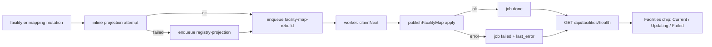

# Facility projection and report-dimension updates — durable and observable

Date: 2026-08-08
Status: agreed, not implemented
Source: `docs/audit/2026-08-07-facilities-page-audit.md` (external audit by Codex) — FAC-P0-08 and
FAC-P0-01, i.e. Phase 0 item 6.
Predecessor: `docs/superpowers/specs/2026-08-07-facilities-phase-0-design.md` (Phase 0 items 1–4,
merged as `8af8c245`).

## Purpose

Two defects, one root cause. Saving a facility mapping does not update the report-facing
`facility_map`; a separate hidden menu action does. And a failed concept projection is caught and
logged while the operation reports success. Both let the interface say a thing is done while reports
disagree.

This closes them by making the work **durable** (recorded, retried, survives a crash) and
**observable** (the operator can see Current / Updating / Failed and act).

## Scope

In scope: FAC-P0-08 (projection failures hidden) and FAC-P0-01 (mapping success and report output
disagree).

Explicitly **out of scope**:

- **FAC-P0-07 — `facility_map`'s natural key omits the observed coding namespace.** Deferred to its
  own spec. Measured as latent, not live (see below), and it is an independent subsystem: a schema
  change with a blast radius across every seeded report join. Deliberately not folded in — a spec
  large enough to review dishonestly is how a cross-task defect got through last time.
- All P1 and P2 audit findings.
- The follow-ups Phase 0 created: `facilities repair-links`, and a settle path for the
  mapping-conflict queue (`resolved_at` has no writer).

## Measured before designing

On the live dev analytics database, 2026-08-08:

| Fact | Value |
|---|---|
| `diagnostic_reports` rows | 7 520 |
| rows with `performer` | 7 520 |
| rows with `performer_system` | 7 520 |
| **distinct `performer_system`** | **1** |
| **distinct `source_system` (feed)** | **1** |
| `facility_map` rows | **88** |
| distinct observed codes | 88 |

Two consequences, both load-bearing for this design:

1. **FAC-P0-07 is latent.** With one namespace and one feed, no two rows can collide on
   `facilityMapId(source_system, source_code)` today. It becomes live when a second feed or a second
   performer namespace appears. That is why it is deferred rather than urgent.
2. **The dimension is small and stays small.** `facility_map` holds one row per *observed* facility
   string per feed — bounded by how many laboratories actually send data, not by the 14 209-row
   national register. A full rebuild is cheap now and remains cheap. **Incremental row-patching is
   therefore not worth its complexity**, and this design reuses the existing, proven
   `publishFacilityMap` full-rebuild primitive rather than inventing an incremental path.

## Decisions taken

Operator decisions, not defaults:

1. **Enqueue + worker, with the UI showing `Updating`** — rather than rebuilding inline in the save
   request, or rebuilding on a timer. A mapping save returns immediately; a worker rebuilds within
   seconds. The window where the mapping is saved but reports are stale still exists, but it is now
   visible and bounded instead of silent and permanent.
2. **Failures surface as a Facilities health chip with Retry** — not additionally through the
   notification bell. The bell is fed from `sync_activity` and `audit_events`; adding a third
   producer is scope the audit did not ask for.

Two design choices confirmed with the operator:

- **Projection stays INLINE, with the job as a fallback on failure.** A prior slice explicitly fixed
  "register a facility and immediately open the mapping picker and find it, with no Publish step
  first". Making projection asynchronous would regress exactly that. The job exists to make a
  *failed* projection durable, not to take over the happy path.
- **`Stale` is a safety state that should never appear** — a mutation newer than the last successful
  build with no job pending. It is rendered because a state that cannot be displayed cannot be
  diagnosed, not because it is expected.

## Prior art this follows rather than reinvents

`terminology_ingest_jobs` (migration `061`) and `createTerminologyIngestJobStore`
(`packages/db/src/terminology-ingest-job-store.ts`) already solve this shape in this repo:
race-safe `claimNext`, `updateProgress`, `finish`, and `failStaleRunning` for crash recovery. The
worker is `packages/bootstrap/src/terminology-ingest-worker.ts`.

⛔ **Copy `061`'s `active_key` mechanism, not a `WHERE`-based partial unique index.** That file
documents a real pg-mem planner bug: after a row's status moves out of a partial predicate, pg-mem
excludes that row from *any* later query filtering on the indexed column, even queries with no status
filter. A plain unique index on an app-managed nullable column gives identical real-Postgres
guarantees without it.

## Architecture

### Migration `079` — `facility_jobs` (internal)

| Column | Purpose |
|---|---|
| `id` | text primary key |
| `kind` | `'facility-map-rebuild'` \| `'registry-projection'` |
| `status` | `queued` \| `running` \| `done` \| `failed` |
| `attempts` | integer, bounded retry |
| `last_error` | text |
| `registry_id` | nullable — which facility, for a projection job |
| `requested_by` | actor, for audit |
| `requested_at`, `started_at`, `finished_at` | timestamps |
| `active_key` | app-managed; see below |

**`active_key` is non-null only while `status = 'queued'`**, and `claimNext` clears it in the same
statement that flips the row to `running`. A plain unique index on `active_key` then gives two
properties at once:

- a rebuild request arriving while one is **already queued** is absorbed — coalescing, so a CSV
  import touching 14 000 facilities enqueues one rebuild, not 14 000;
- a change arriving while a rebuild is **running** creates a *fresh* queued job rather than being
  swallowed by a build that has already read the data.

That second property is the one an obvious implementation gets wrong.

### Two job kinds

**`facility-map-rebuild`** runs `publishFacilityMap({ apply: true })`. Enqueued after anything that
can change resolution: facility create, update, delete, CSV import apply, and mapping save,
supersede, or remove.

**`registry-projection`** retries a facility's concept projection, and is enqueued **only when the
inline attempt has already failed**. `projectRegistryRows` keeps its never-throws contract and its
inline behaviour; this job is what makes the failure durable instead of a `console.error`.

### Worker

`packages/bootstrap/src/facility-job-worker.ts`, modelled on the terminology ingest worker:
`claimNext` → run → `finish`. On boot it calls the store's `failStaleRunning` equivalent so a job
interrupted by a crash is marked failed and becomes visible and retryable, rather than sitting
`running` forever.

Retries are bounded at **5 attempts, one per worker tick** — there is **no backoff**. The tick is a
fixed 3s and `retryPreservingAttempts` does not defer the re-queued row, so a job spends its whole
budget in roughly 15 seconds and an outage longer than that lands a permanent `failed`.

This line previously promised backoff, which the shipped worker does not implement. Backoff was
weighed and **deliberately deferred** rather than built, because a permanent `failed` here is
recoverable by two independent paths that both exist:

- it is **visible** — the Facilities chip renders `Failed` with the error and a Retry that resets the
  budget, which is the outcome this slice actually exists to guarantee (visible, not silent); and
- the mechanism **self-heals on the next write** — `finish` releases the job's `active_key`, so the
  very next facility or mapping mutation enqueues a fresh rebuild that runs normally. A permanently
  failed job does not wedge anything.

Implementing it properly needs a `next_attempt_at` column (migration 080) plus a `claimNext` filter —
new schema surface, which is not something to add during a fix wave. Deferred to its own slice; until
then this paragraph describes what the code does.

A job that exhausts its budget stays `failed` with its `last_error` — it does not silently disappear,
and Retry from the page resets the count so an operator who has fixed the underlying cause is not
locked out. Retry is **refused (409) while the job is `running`**: re-queueing a live run re-arms its
`active_key`, and that run's own `finish` then writes a terminal status, discarding the retry.

### Health surface

`GET /api/facilities/health`, gated on `facilities.view`:

```
{ reportDimension: { state, lastSuccessAt, rows, error, jobId },
  projection:      { failedCount, failed: [{ id, registryId, lastError }] } }
```

Both halves carry a job **id**, because `POST /jobs/:id/retry` needs one and this is the only
endpoint that exposes `facility_jobs` ids at all. `reportDimension.jobId` is non-null exactly when
`error` is (the latest rebuild failed). `projection.failed` is one entry per facility whose
projection is broken — one entry, and one Retry action, PER FACILITY, since projection jobs coalesce
per facility and a single grouped action could only ever repair one of them. `failedCount` is
derived as `failed.length` so the two cannot disagree.

A failed projection self-clears when a strictly newer job for that same facility supersedes it. It
does **not** clear on a successful INLINE projection — those write no job row for anything to
observe — so that case clears only via an explicit Retry.

`state` resolves as:

| State | Condition |
|---|---|
| `Current` | no queued/running/failed job, and the last successful build is newer than the last mutation |
| `Updating` | a job is queued or running |
| `Failed` | the most recent attempt failed |
| `Stale` | a mutation is newer than the last success with no job pending (safety net) |

"The last mutation" is `max()` over `facility_registry.updated_at` and `term_mappings.updated_at` —
the two tables whose contents determine what a rebuild would produce. Both already carry
`updated_at`, so this needs no new bookkeeping and cannot drift from the thing it describes.

The Facilities page renders this as a chip with the last successful build time and a Retry action.
Retry re-enqueues rather than running inline.

**CLI parity** (a hard repo convention): `openldr facilities jobs` lists job state, with a retry flag.

### Truthful partial success

Facility create and update currently return plain success even when the inline projection threw. They
will instead report the projection outcome — the registry write is committed, the projection is
queued for retry — so the API stops claiming more than happened. **A projection failure still never
fails the write**; that contract is unchanged.

## Data flow



## Error handling

- **Inline projection fails** → `registry-projection` job enqueued; the mutation response reports
  partial success; the chip's `projection.failedCount` is non-zero.
- **Rebuild fails** → job `failed` with `last_error`; chip shows `Failed` plus Retry; attempts bounded.
- **Process crashes mid-run** → `failStaleRunning` on boot marks it `failed`, so it surfaces rather
  than wedging as a permanently `running` row.
- **Warehouse unreachable** → the rebuild job fails and retries; the mapping save is unaffected,
  because it never depended on the warehouse.

## Testing

The load-bearing test is the audit's own, and it fails against every version of this code to date:

> Save a facility mapping, run the worker, then execute an actual report query and assert the
> facility changed — with **no manual Publish anywhere in the test**.

Also required:

- **Coalescing, both directions:** a second request while one is queued is absorbed; a request while
  one is *running* creates a new queued job and is not swallowed.
- Worker claim race — two workers, one job, claimed once.
- Crash recovery — a `running` row left by a killed process becomes `failed` and retryable.
- Projection failure → durable job → partial-success response → retry succeeds.
- Each chip state, including `Stale`.
- Bounded retry — a permanently failing job stops retrying and stays visible.
- The existing "a projection failure never fails the facility write" contract still holds.

## Acceptance criteria

- Saving, removing, or remapping a facility changes report-facing resolution **without any
  undocumented manual rebuild**.
- The UI cannot show a mapping as complete while its required report update is silently failed.
- A failed projection is durable, visible, and retryable — never only a `console.error`.
- A crashed worker leaves a visible failed job, not a permanently running one.
- A CSV import touching thousands of facilities enqueues **one** rebuild.
- `openldr facilities jobs` reports the same state the page shows.

## Sequencing

Four slices, each independently reviewable:

1. `facility_jobs` table (migration `079`) + store, with the `active_key` coalescing semantics.
2. Worker + crash recovery, wired into bootstrap.
3. Enqueue at every mutation site; inline projection retained with the job as fallback; truthful
   partial-success responses.
4. Health endpoint, Facilities chip, Retry, CLI parity.

Slice 3 is the one that closes FAC-P0-01; slice 4 is what makes FAC-P0-08 observable.
